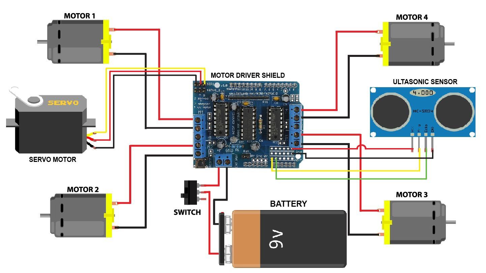

# Arduino-based-Obstacle-Detecting-Car
Arduino-based car that utilizes ultrasonic sensors to detect and avoid obstacles

https://drive.google.com/file/d/1N4ii9MJiHEWqb8aQLrDS6pElsUyvZUfm/view?usp=sharing

## Overview

This prototype demonstrates fundamental concepts in:
- Sensor integration with microcontrollers
- Real-time decision making based on sensor input
- Practical application of programming logic

## Features

- Obstacle detection using HC-SR04 ultrasonic sensors
- Autonomous decision making for obstacle avoidance

## Components

- Arduino Uno/Nano
- HC-SR04 Ultrasonic Sensor
- L298N Motor Driver
- DC Motors
- Chassis

## Circuit Diagram

## How It Works

1. The ultrasonic sensor constantly measures the distance to objects in front of the car
2. When an obstacle is detected within a threshold distance (e.g., 20cm), the car stops
3. The car then decides which direction has more clearance (optional: if multiple sensors used)
4. The car turns in the preferred direction and continues forward
5. This process repeats, allowing the car to navigate autonomously

